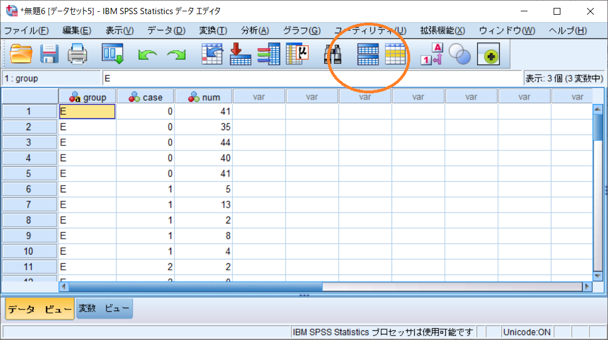
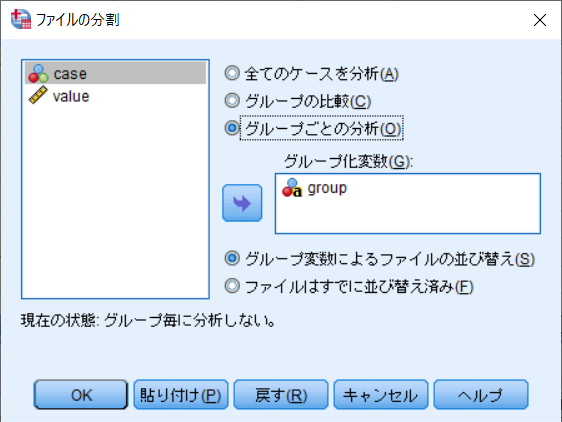
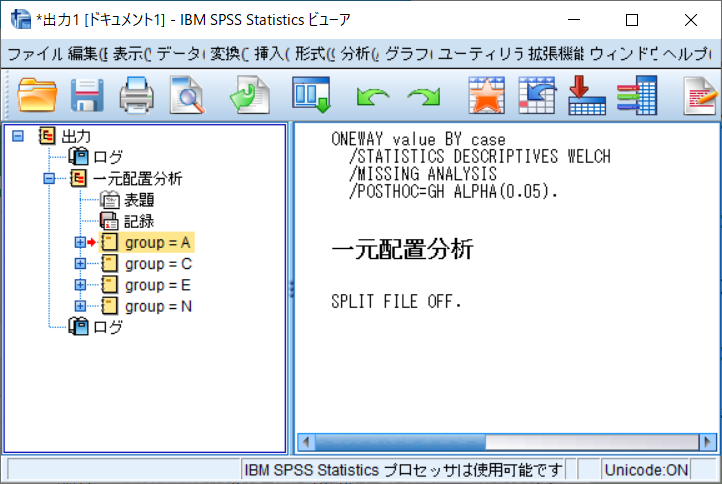

# SPSS
使い方や参考になるURL集．

## T-test

## ANOVA

- パラメトリック
- ノンパラメトリック
    - 対応無し：クラスカル＝ウォリス
    - 対応あり：フリードマン

## 他

## Tips: 同じ分析を複数回実行したい

`ファイルの分割`機能を使う．

[こんな感じのファイル](./SPSS/grouping.txt)を用意する．この例ではANOVAを実行する．ここで，変数`group`はグルーピングに使用する値，`case`は群，`value`は観測値．

SPSSに読み込ませる．その後`ファイルの分割`ボタン（オレンジの丸の部分）をクリック．

その後以下の図のようにする．

いつものように分析．以下のようにグループごとの分析結果が出力される．

